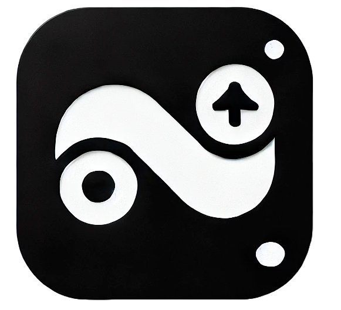

<p align="center">
  
</p>

# 🚀 NotyBackup – Simple & Automated Notion Backups

With the help of ChatGPT, I built **NotyBackup**, a simple and free app to automate **backups of Notion databases**.  

I created this because I use Notion to manage my **PhD research**, and I wanted an automated way to back up my data in case something went wrong. With this app, you can export **Notion databases as CSV files automatically**.  

You can deploy it on **Docker** or **Portainer** to run it on your server and schedule backups.  

⚠️ **Note:** I'm not a developer, so this might have bugs – feel free to test it out and suggest improvements! 😊  

---

## 📸 **Screenshots**
🔹 https://ibb.co/Ng9vjVd7
🔹 https://ibb.co/Q37Fpvkp
---

## 🔗 **Links**
- 🐳 **DockerHub**: [NotyBackup](https://hub.docker.com/repository/docker/drakonis96/notybackup/general)  
- 💻 **GitHub**: [NotyBackup Repo](https://github.com/Drakonis96/notybackup)  

Would love your **feedback**! Let me know if you have any ideas or suggestions. 💡  

---

## ✨ **Features**
✅ **Automated Notion → CSV exports** 📄  
✅ **Runs as a background task** – refresh the page to see results 🔄  
✅ **Schedule backups** (intervals or specific times) ⏳  
✅ **Store multiple databases** and manage them easily 📚  
✅ **Track backup history** 📜  
✅ **One-click deletion of old backups** 🗑  
✅ **Completely free & open-source!** 💙  

---

## 🛠 **How to Use?**
1️⃣ **Set up your Notion API key & Database ID** (instructions below) 🔑  
2️⃣ **Enter your Notion Database ID** 📌  
3️⃣ **Choose a file name for the CSV** 📄  
4️⃣ *(Optional)* **Set up scheduled backups** 🕒  
5️⃣ **Click "Start Backup"** – The backup runs in the background, so refresh the page to check the result! 🚀  

---

## 🔑 **Set Up Your Notion API Key & Database ID**
### **1️⃣ Create Your API Key**
1. Go to [Notion Integrations](https://www.notion.so/my-integrations).  
2. Click **New Integration**, assign a name, and select your workspace.  
3. Copy the **Secret API Key** – you’ll need to provide this when setting up the Docker container.  

### **2️⃣ Get Your Database ID**
1. Open your database in Notion.  
2. In the URL, find the **32-character block** that appears **before `?v=`**.  
3. Copy this value and use it in the corresponding field in the app.  

### **3️⃣ Grant Access to the Integration**
1. Inside Notion, open the database you want to back up.  
2. Click on the three dots **(⋮)** in the top-right corner, then select **Connections**.  
3. Find your **Integration Name** and **grant access** so the app can read the data.  

---

## 🛠 **Deployment (Docker & Portainer)**
### **Docker**
Run the following command to start NotyBackup as a container:
```sh
docker run -d --name notybackup \
  -e NOTION_API_KEY="your-secret-api-key" \
  -e DATABASE_ID="your-database-id" \
  -v /path/to/backups:/app/backups \
  drakonis96/notybackup
